# Installing MySQL

## Overview

The goal of this section is to serve as a detailed guide for installing MySQL 8 on a Windows 10 or a Mac environment.

## Install MySQL on Windows

1.  Navigate to [MySQL's official website](https://dev.mysql.com/downloads/installer/) and download the full MySQL installer package
    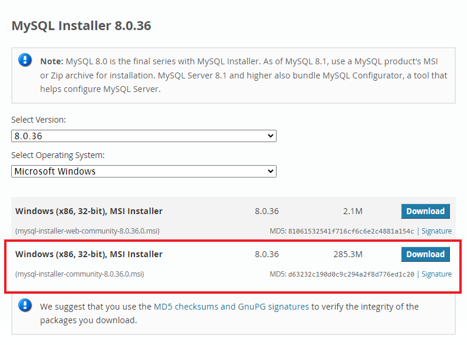{ width="500" }

    !!! info
    You **DO NOT** need to sign up, instead click **No thanks, just start my download**.

2.  Execute the downloaded installer file, allowing User Account Control to authorize changes to your device. Accept the License Agreement and select the "Custom" option in "Choosing a Setup Type".

    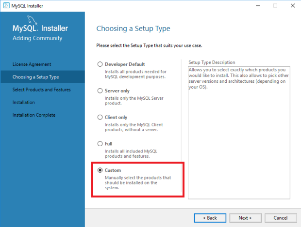{ width="500" }

3.  It's suggested installing the following components for a comprehensive setup:

    - MySQL Server 8.0.11 (X64)
    - MySQL Workbench 8.0.11 (X64)
    - MySQL Shell 8.0.11 (X64)
    - Connector/ODBC 8.0.11 (X64)
    - MySQL Documentation 8.0.11 (X86)
    - Samples and Examples 8.0.11 (X86)

    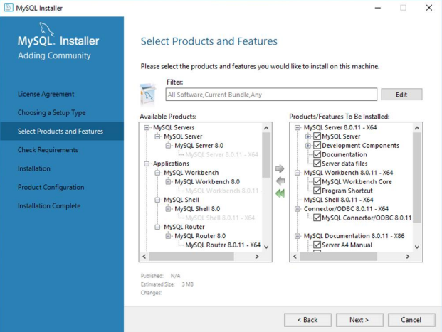{ width="500" }

    !!! note
    It is advised to select the latest available versions of these components.

4.  Install Microsoft Visual C++ Redistributable.

    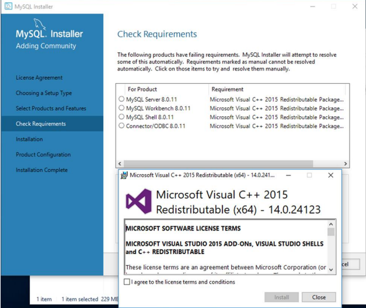{ width="500" }

5.  **Click** execute and wait untill all products will be installed.

    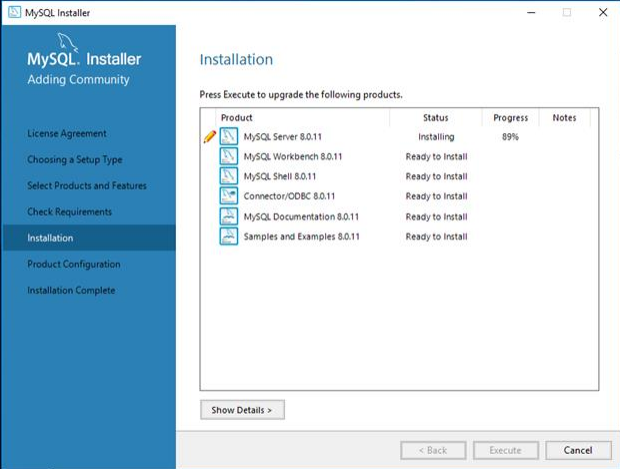{ width="500" }

6.  Rerun MySQL Installer. **Click** reconfigure, under Quick Action, next to MySQL Server.
    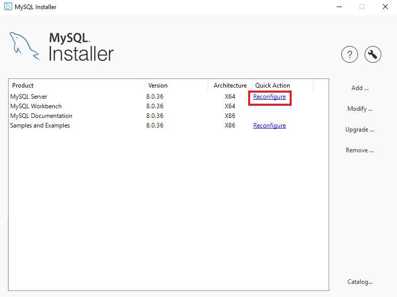{ width="500" }

    !!! tips
    You can rerun it by going to your Windows **Start Menu**

7.  The configuration process involves setting up MySQL as a standalone server, configuring development computer settings, and choosing strong password encryption for authentication.

    !!! note
    The install wizard for this software **changes frequently**. If what you see is a bit different from this guide, you can just go with the default options and keep installing.

    - Group Replication
      **Click** Standalone

      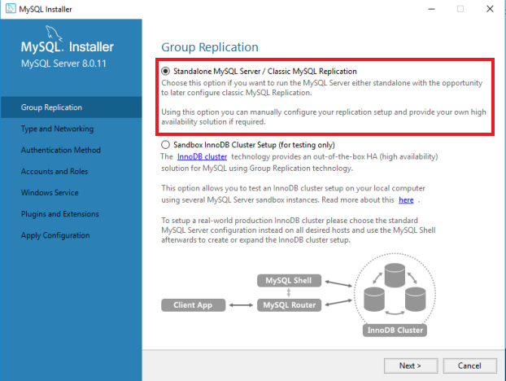{ width="500" }

    - Type and Networking
      **Choose** Development Computer for Config Type, **click** Show Advanced Options, **keep** all other defaults

      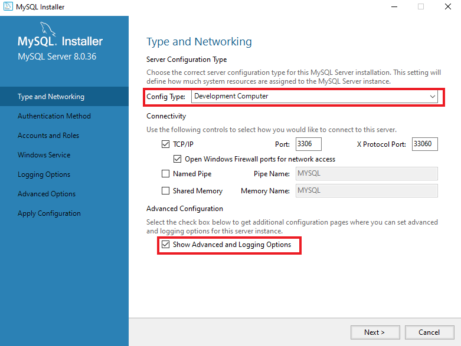{ width="500" }

    - Authentication method
      **Click** Use Strong Password Encryption for Authentication. Then, **click** next and **create** a strong root password.

    !!! note
    Create a root password and make a note of it for future reference.

    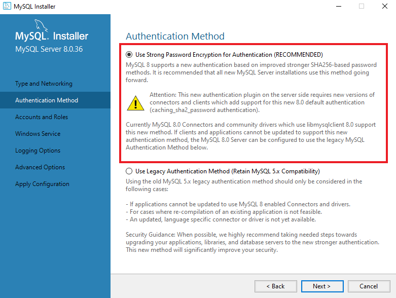{ width="500" }

    - Windows Service
      There should be all default options

    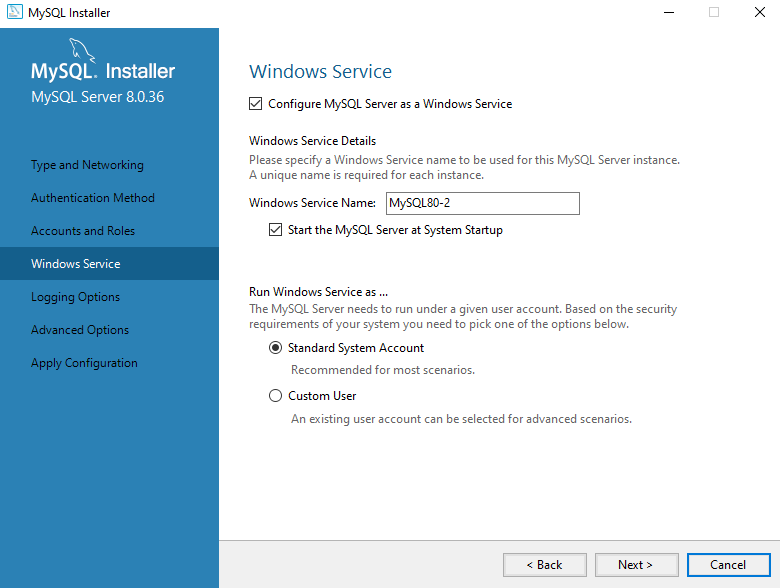{ width="500" }

    - Plugins and Extension
      Leave the MySQL Document Store feature **unchecked**, because we are not going to use it.

    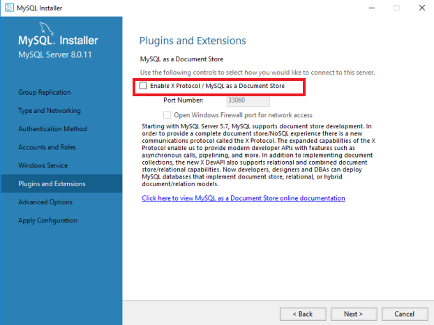{width="500"}

    - Advanced Options
      There should be all default options

    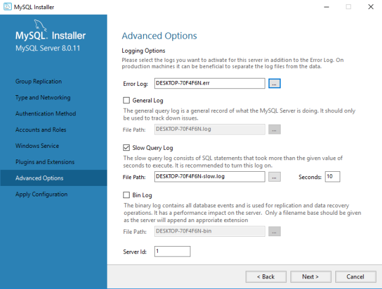{ width="500" }

    - Apply Configuration
      **Click** on execute button

8.  **Click** reconfigure next to Samples and Examples

    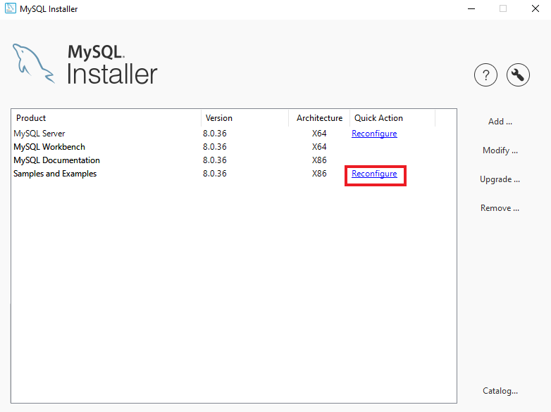{ width="500" }

9.  Type your root password that you created at Authentication method section. **Click** check, then **click** next.

    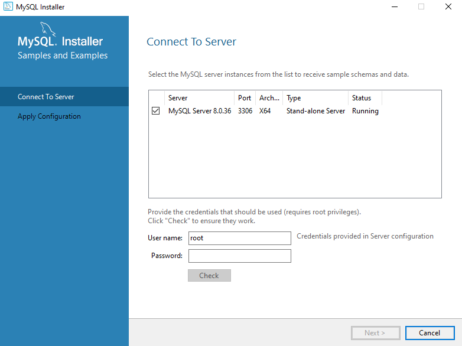{ width="500" }

    Apply Configuration
    **Click** on execute button, wait until it finished, **click** on next button.

10. **Verify** connectivity to MySQL via the Command Prompt using the root user credentials.
    **Click** Start Menu – type cmd and click Command Prompt Desktop App. Then, inside prompt, type **mysql -u root -p**, it will connect to the localhost with user root.
    Your promt should change to **mysql>**. **Run** command `show variables like "version";`, the app will return the version of your MySQL.

## Install MySQL on Mac

1. Navigate to [MySQL's official website](https://dev.mysql.com/downloads/mysql/) and download **macOS 14 (x86, 64-bit), DMG Archive** version for installing MySQL Community Server.

   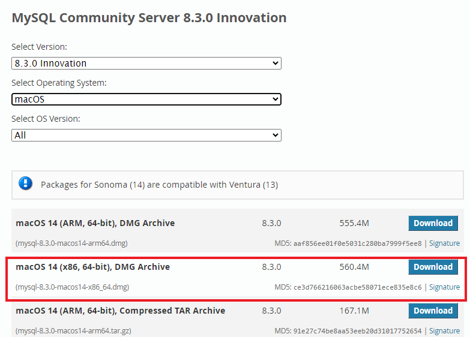{ width="500" }

   !!! note
   You **DO NOT** need to sign up, instead click **No thanks, just start my download**

2. Open the DMG file from the Downloads folder, then run the PKG file within to start the installation process.

   !!! warning
   The system might warn you about installing this package. **Click** allow to continue.

3. Follow the steps in the MySQL Community Installation Wizard, agreeing to the License Agreement, leaving the default install directory and selecting Strong Password Encryption when prompted.

   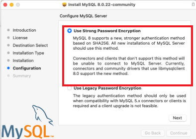{ width="500" }

   Create a new password for your MySQL root account and remember it, as it will be needed for login.

   Confirm the successful installation by **clicking** Close at the completion screen.

   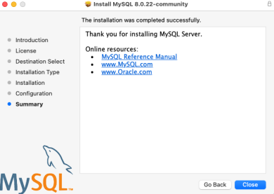{ width="500" }

4. Go to [MySQL's official website](https://dev.mysql.com/downloads/workbench/) to install MySQL Workbench. **Download** the same package as you did for Community Server, and open it.
   Drag the MySQL Workbench icon to the Applications folder to install. Launch MySQL Workbench from the Applications folder.

   !!! note
   If macOS blocks the application because it cannot verify the developer, proceed to System Preferences > Security & Privacy and click Open Anyway.

5. Try to run MySQL Workbench.

   !!! note
   If macOS blocks the application because it cannot be checked for malicious, proceed to System Preferences > Security & Privacy and click Open Anyway.

6. **Verify** connectivity to MySQL via the Terminal app using the root user credentials.
   **Open** the Terminal App. Then, type **mysql -u root -p**, it will connect to the localhost with user root.
   Your promt should change to **mysql>**. **Run** command `show variables like "version";`, the app will return the version of your MySQL

## MySQL Workbench

1.  Open MySQL Workbench
    It will look like this when you open it:

    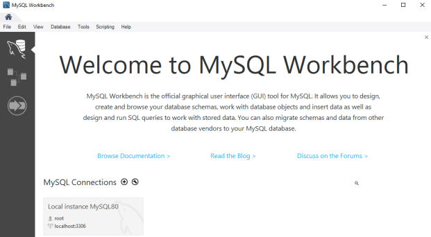{ width="500" }

    !!! note
    The MySQL Workbench interface is consistent across both Windows and Mac platforms, therefore, this documentation will not differentiate between the two.

    If you don't have any connections under MySQL Connections, you can create a new one by **clicking** on { width="20" } button

    **Enter** a connection name and leave all defaults. **Click** Ok

    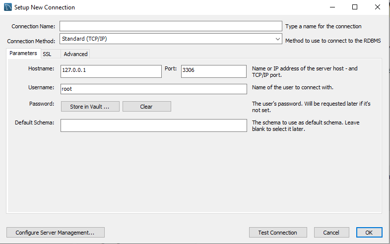{ width="500" }

    !!! tips
    You can click on Test Connection button before pressing Ok to see if it works. It will ask for your root password.

2.  Open your connection by **double clicking** on it and enter your root password.
    Once open it will look like this

    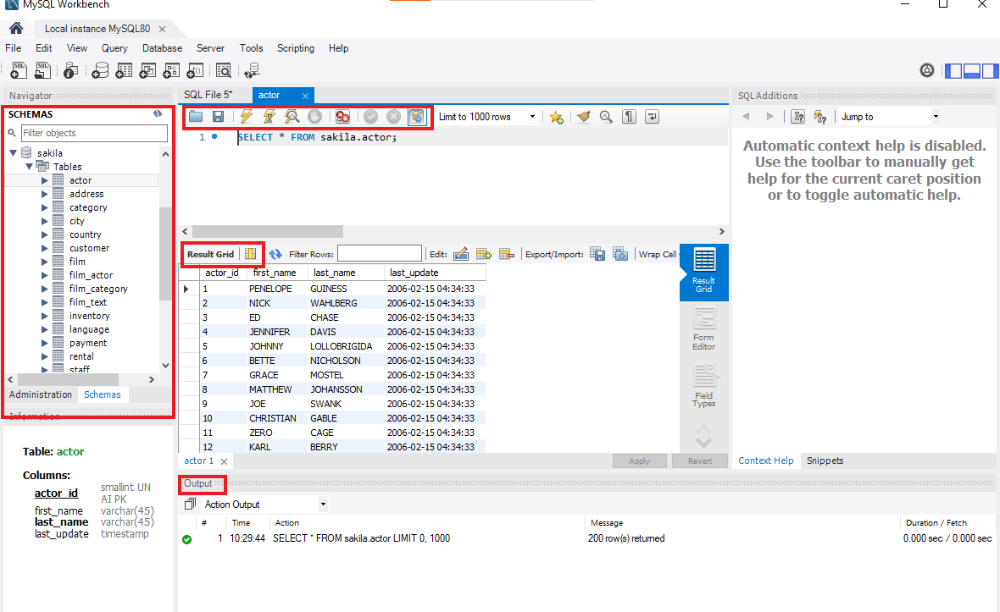{ width="500" }

    The MySQL Workbench interface features four primary areas:

    - The Schema (or Database) Section, located at the right, displays all the databases, tables, views, procedures, and functions.
    - At the top, the Query Section is where queries are entered or SQL files are opened. The lightning bolt icon with cursor { width="20" } allows for the execution of individual queries.
    - Results from executed queries, such as SELECT or SHOW TABLES commands, are shown in the Result Grid directly below the Query Section.
    - Additional information about executed queries is found in the Output Section, including the number of rows returned, execution time, or errors, along with hints for correcting syntax issues.

3.  Practice Time!
    In the Query type the following command:
    `SHOW VARIABLES LIKE 'version';`
    and **click** { width="20" }.

    !!! info
    The MYSQL keywords are **case insensitive**, so you can type it both lowercase and uppercase (ex. show variables like 'version';).

!!! success
The result should look like this:

    { width="500" }

## Conclusion

By the end of this section, you will have successfully learned the following:

- How to install MySQL on your computer.
- How to connect to MySQL using the MySQL Workbench.
- How to run queries in MySQL Workbench.

Great work! :heart: To deepen your understanding of MySQL schemas and tables, make sure to explore [Schemas and Tables](./SchemasAndTables.md).
