# Schemas and Tables
## Overview
In this section, you will learn how to create a schema, and add a table to a schema to in order to benefit from the usage of database management software. Database management software like MySQL allows for better data security, data sharing and can help reduce data redundancies.

!!! warning 
    Due to the limitations of our documentation, an understanding on configuring your MySQL server and configuring a connection is not covered. However, it is a pre-requisite to creating a schema or table.

## Creating a Schema
1. Open MySQL Workbench.

2. Connect to your MySQL database by **Clicking** on your previously configured connection, 

    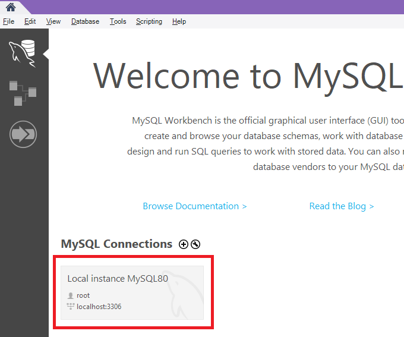

3. **Right Click** in the whitespace of the navigator panel (by default on the left side of the application window).
4. **Click** create schema from the dropdown menu. 
    
    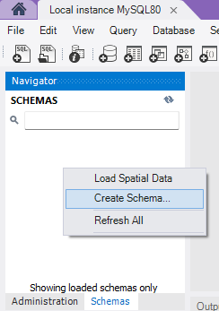
!!! warning
    Ensure that you are in the schemas tab and not the Administration tab (option at the bottom of the navigator section)

    A new panel should appear in the main area of the application.
    
5. Specify a name for your schema in the newly opened panel.
6. **Click** on the apply button at the bottom right of the panel. 
    
    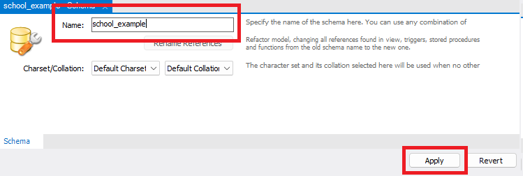

    Upon clicking apply, you will be prompted to review the SQL statement that will run to create your new schema.
    
    The prompt will look like this:

    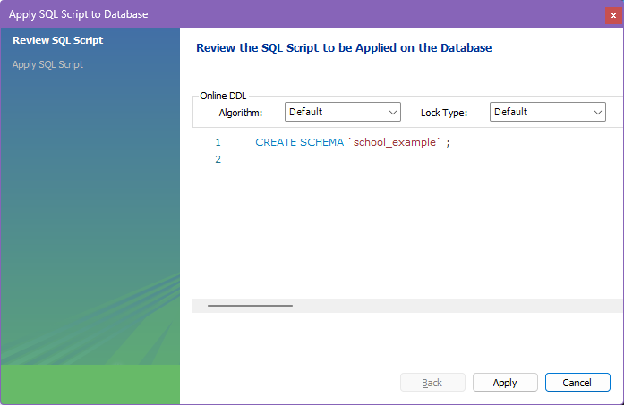

7. Verify that the name of the schema is correct.
8. **Click** apply to create the schema or **Click** cancel to make any changes.

    Once created our Schema should appear in the schema list automatically. 

!!! success
    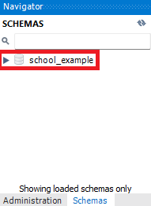

    Congratulations, you have created your first schema!

!!! tips
    We can close the schema panel that was previously opened for us once our schema has been created. This helps to reduce cluttering our workspace with unnecessary tabs.

## Creating a Table
1. **Double Click** the schema name to specify the schema to use.
    
    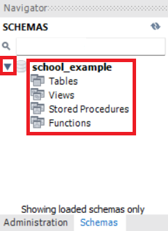{width="500"}
    
    The schema name becomes bold once it is selected and should expand to show additional options.

    If the schema has not expanded, **Click** on the triangular icon to the left of the schema name to expand it. 

2. **Right Click** on Tables

3. **Click** Create Table from the dropdown menu. 

    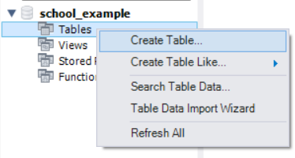
    
    A new panel should appear in the main area of the application. 
    
    Specify your table name, column names, column data types and column options.

    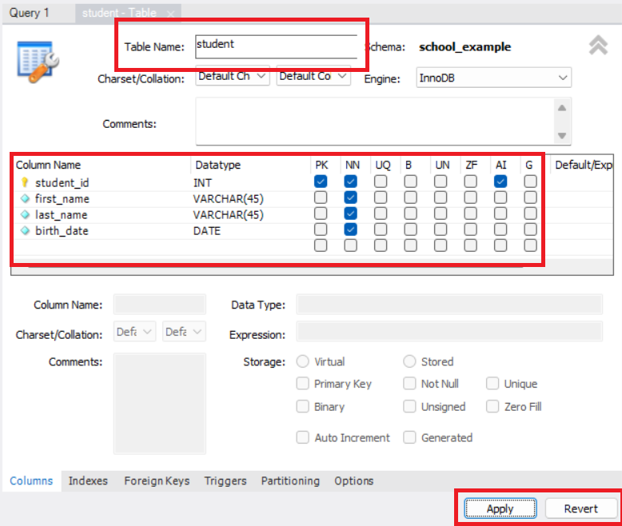
    
!!! tips 
    For more information on MySQL data types and column options visit:

    - [MySQL 8.0 Data Types](https://dev.mysql.com/doc/refman/8.0/en/data-types.html)
    - [MySQL 8.0 Create Table Options](https://dev.mysql.com/doc/refman/8.3/en/create-table.html#create-table-options)

4. **Click** on the apply button once you are ready to create your table.
    
    Upon clicking apply, you will be prompted to review the SQL statement that creates your new table and the columns within it:

    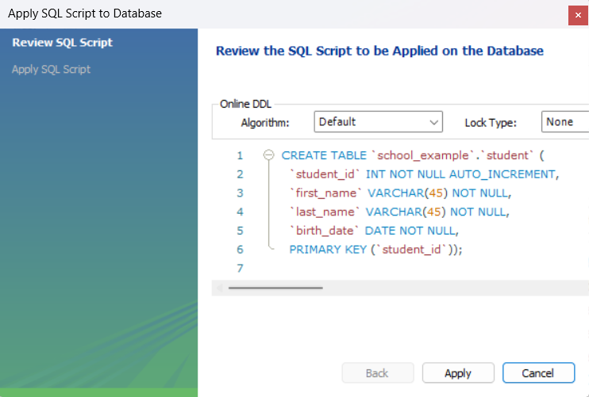

5. Verify that the table name, columns and column properties are correct.
6. **Click** apply to create your table.

!!! success
    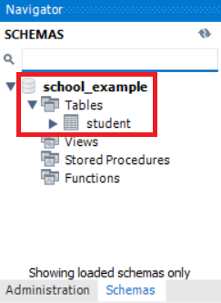

    Congratulations, you have added a table to your schema!

!!! tips
    The new table panel can be closed after the table has been made. 
    
    If you would like to modify the properties of the table in the future using the user interface simply reopen the panel by:
       
    1. **Right clicking** the table name from the list of tables within your schema.
    2. **Clicking** alter table.
    

## Adding data to a Table
1. **Right Click** on your table from the table list in your schema.
2. **Click** Select Rows - Limit 1000 from the dropdown menu.

    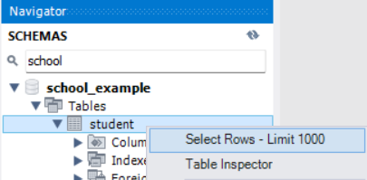
    
    This runs a SELECT query for entries in your table. 
    
    View our documentation on [SELECT Statements](./Task3Emmy.md) for more information on SELECT queries.

    Just below the main window, you will find the SELECT results for your table:
    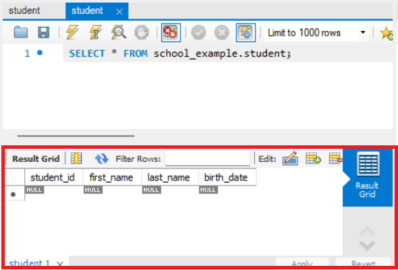

3. Enter your data into their respective columns.

    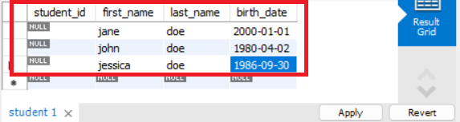
!!! warning
    MySQL will enforce table rules and column rules on any data you attempt to add and will error if it does not follow the table data types, or set rules.

4. **Click** on the apply button below the results when you're ready to add the data to your table.
    
    You will be asked to review the SQL statement that inserts your data into your table:
    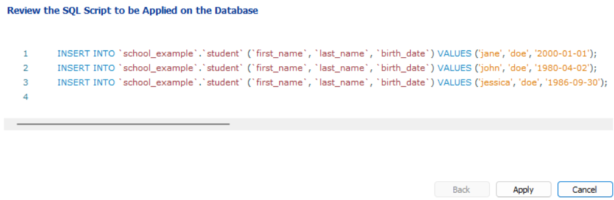

5. **Click** on apply after confirming that the data is correct to add it to your table.

!!! success
    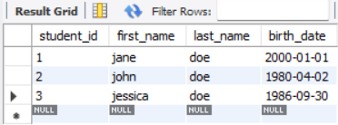

    Congratulations, you have added data to your table!

## Conclusion

By completing this section, you will have learned the following:

* How to create a new schema.
* How to create a table in a schema.
* How to add data to a table.

Great work! :heart: To learn more about MySQL queries, be sure to check out the next section on [Select statements](./Task3Emmy.md).
